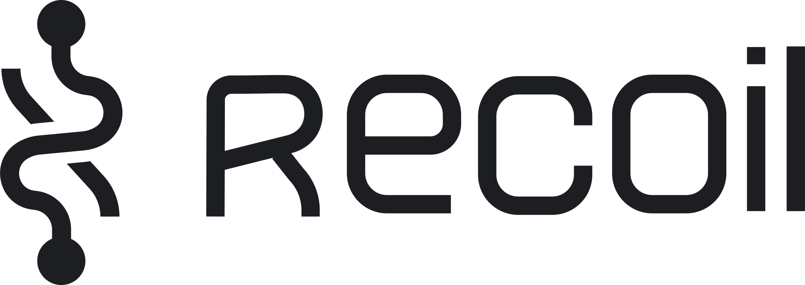

# Yoan Gauthier |  

## About
---
## Education
### __2020-2021__ | Master of Management Innovation & Entrepreneurship [@Smith School of Business](https://smith.queensu.ca/), [@Queen's University](https://www.queensu.ca/)
### __2016-2020__ | Bachelor of Engineering, Computer Science - Artificial Intelligence and Data Science [@Polytechnique Montréal](https://www.polymtl.ca/)
---
## Projects

_My projects are mainly self-hosted and use these common technologies_

---

### __2021 | Augmented Reality Sport Game | [website](https://pholi.io)__ 

  

#### Technologies

---

### __2021 | Klap AI | [website](https://klap.ai)__

  

Final personal innovation project from the [MMIE](#2020-2021--master-of-management-innovation--entrepreneurship-smith-school-of-business-queens-university) program. Klap AI is still in development phase. It includes two different product that are still in exploration.

The first one is an audio service that filters out everything except hand claps and laughs. The main focus is on claps right now (checkout the [demo](https://klap.ai/#demo)). It's objective is to be used as an incentive for supporters of content creators in live events such as Youtube Premiere, Twitch Streams and Conferences.

The second one is a video stream sentiment analysis service for companies doing webinars. It aims to be a live feedback metric for the  speaker in virtual settings. It gives a realtime pulse of the emotions in the audience.

#### Technologies
_Backend_

_Frontend_

---

### __2021 | 3D Rpg Multiplayer Roguelike Game__ 

  

#### Technologies

---

### __2020 | Laboulette | [website](https://laboulette.fun)__
Laboulette is an exciting social game done by two friends right when pandemic started that allows to play the french version of _fishbowl_ with friends online. The project went through a testing phase with end-user testing and release phase where core feature were added progressively.

  

#### Technologies
_Frontend_

_Backend_

---

### __2020 | Geosense | [website](https://geosense.io/)__
This project is a rebooted version of [geosense.net](https://web.archive.org/web/20120208085752/http://geosense.net/). The old website domain has been reclaimed by another organization. It is an open-source work in progress. The game is simple to learn and fun to play. It's purpose is to increase knowledge of geo-localization of cities and countries around the world.

  

 
#### Technologies
_Frontend_

_Backend_

---

## Professional Experience
## Github Stats

[//]: <> (Colors done with: https://codepen.io/sosuke/pen/Pjoqqp)
