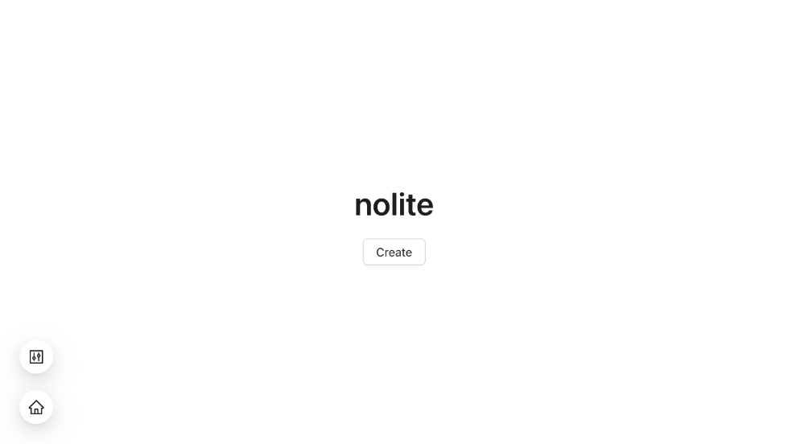

# Yoan Gauthier | 

## About

Welcome to my portfolio, this list most of my projects. If the code is private don't hesitate to request access. Checkout my [ LinkedIn](https://www.linkedin.com/in/yoangau/?locale=en_US) for my professional experience and don't be shy to contact me (except don't cold call).

---
## Education
### __2020-2021__ | Master of Management Innovation & Entrepreneurship [@Smith School of Business](https://smith.queensu.ca/), [@Queen's University](https://www.queensu.ca/)
### __2016-2020__ | Bachelor of Software Engineering - Artificial Intelligence and Data Science [@Polytechnique Montreal](https://www.polymtl.ca/)
---
## Projects

_My projects are mainly self-hosted and use these common technologies_

### __2023 | Nolite | [website](https://nolite.fyi)__ 

  

This project was completed in one day using serverless technologies. My objective was to create a tool similar to Pastebin, but for markdown notes. It allows users to create rich markdown pages that can be easily shared and copied. Notes can be end-to-end encrypted, password protected and have a time to leave - all without a backend in a serverless application! When a page expires you still retain the local cache copy to renew. It is also possible to create a custom namespace/name url using deterministic uuids keeping all the info on the clients.

#### Technologies

---

### __2023 | Mushroom Unloaded__ 

  

Over a weekend, I worked on a project for my family. We all own an old mushroom hunting book, and I created a limited access app to quickly search the book when identifying future meals. Leveraging Vercel and Next.js's serverless functions and middlewares, I was able to utilize PDF indexing and fuzzy search without the need for a backend.

#### Technologies

---

### __2021 | Mobile AR Sports Game | [website](https://pholi.io)__ 

  

The goal of this project is to create fun and healthy interactions with screens while improving sport skills and performances. The app is supported on every platform and its mission is to be accessible to everyone who wants to play across the world without having to buy any special equipment or buy a new phone.

#### Technologies

---

### __2021 | Klap AI | [website](https://klap-ai.vercel.app/)__

  

This is my final personal innovation project from the [MMIE](#2020-2021--master-of-management-innovation--entrepreneurship-smith-school-of-business-queens-university) program. Klap AI is still in development phase. It includes two different products that are still in exploration.

The first product is an audio service that filters out everything except hand claps and laughs. The main focus is on hand claps right now (checkout the [demo](https://klap.ai/#demo)). Its objective is to be used as an incentive for viewers to support content creators during live events such as Youtube Premiere, Twitch Streams and Conferences.

The second one is a video stream sentiment analysis service for companies doing webinars. It aims to be a live feedback metric for the  speaker in virtual settings. It gives a realtime pulse of the the audience.

#### Technologies
_Backend_

_Frontend_

---

### __2021 | 3D Online Rpg Multiplayer Roguelike Game__ 

  

This is a long term project with whomever wants to join. Free assets are used to prototype and test the mechanics. The goal is to go as far as possible using only free time and staying as lean as possible while doing constant play tests. I want to create a game that can be picked-up by a group of friends who want to play mmo-like tank/healer/dps one night; to have fun while being challenged and not to worry about time commitment (my group of friends falls directly in this category).

#### Technologies

---

### __2021 | Art GAN__

  

  

This GAN project used 100 pictures from an abstract visual [artist](#2020--simple-artist-website--website)'s art collection to train and generate original variants. This is an exploration and we are still in the creation process to do something interesting and unusual with the trained model.

#### Technologies

---

### __2021 | Geosense | [website](https://geosense.netlify.app/)__

  

This project is a rebooted version of [geosense.net](https://web.archive.org/web/20120208085752/http://geosense.net/). The old website domain has been reclaimed by another organization. It is an open-source work in progress that is close to be completed (go check the code). The game is simple to learn and fun to play. Its purpose is to increase knowledge of geo-localization of cities and countries around the world.
 
#### Technologies
_Frontend_

_Backend_

#### Repositories

---

### __2021 | My First Game | [play](https://play.unity.com/mg/other/myfirstgame-31150)__

  

This is my gateway project into game development. Enjoy a 5 minutes playing session and it was done in one day.

#### Technologies

---

### __2020 | Laboulette | [website](https://laboulette.fun)__

  

Laboulette is an exciting social game done by two friends right when pandemic started that allows to play the french version of _fishbowl_ with friends online. The project went through a testing phase with end-user testing and release phase where core feature were added progressively.

#### Technologies
_Frontend_

_Backend_

---

### __2020 | Blog Template | [website](https://fictionalrobot.netlify.app/)__

  

This blog template was an exploratory project to improve technical skills. The core feature is its multilingual markdown support. It allows to simply write blog post in markdown for the supported locales and it will take care of the rest. The plan was to use the template for a portfolio, but it changed and the portfolio is  now here... on GitHub.

#### Technologies

#### Repository

---

### __2020 | Synthetic Dataset Generation & Training__

  

This is the final project of my engineering degree. It was done in partnership with a Montreal XR company. The goal was to train a detection model over a generated synthetic dataset where the only input was an `.obj` file and then export a trained detection model. The exploration was interesting and allowed to us create fully functional and automated customizable pipeline.

#### Technologies

---
  
### __2020 | Data Visualisation Project__

  

This project was perform as a school project with a team of 5 students. Its goal was to visualize climate change in Canada and explore a diversity of data representation methods. This project was a collaboration between [@Polytechnique Montréal](#-2016-2020--bachelor-of-engineering-computer-science---artificial-intelligence-and-data-science-polytechnique-montréal) and [@CBC/Radio-Canada](https://cbc.radio-canada.ca/)

#### Technologies

---

### __2019 | Simple Artist Website | [website](https://www.laurencebelzile.com/#/)__

  

This website was completed after I discovered my significant other was paying for wordpress and was not even happy with what it offered. It was created in a way that allows her to modify the information in the code easily and offers i18n functionalities.

#### Technologies

#### Repository

---

## Public Github Stats

[//]: <> (Colors done with: https://codepen.io/sosuke/pen/Pjoqqp)
